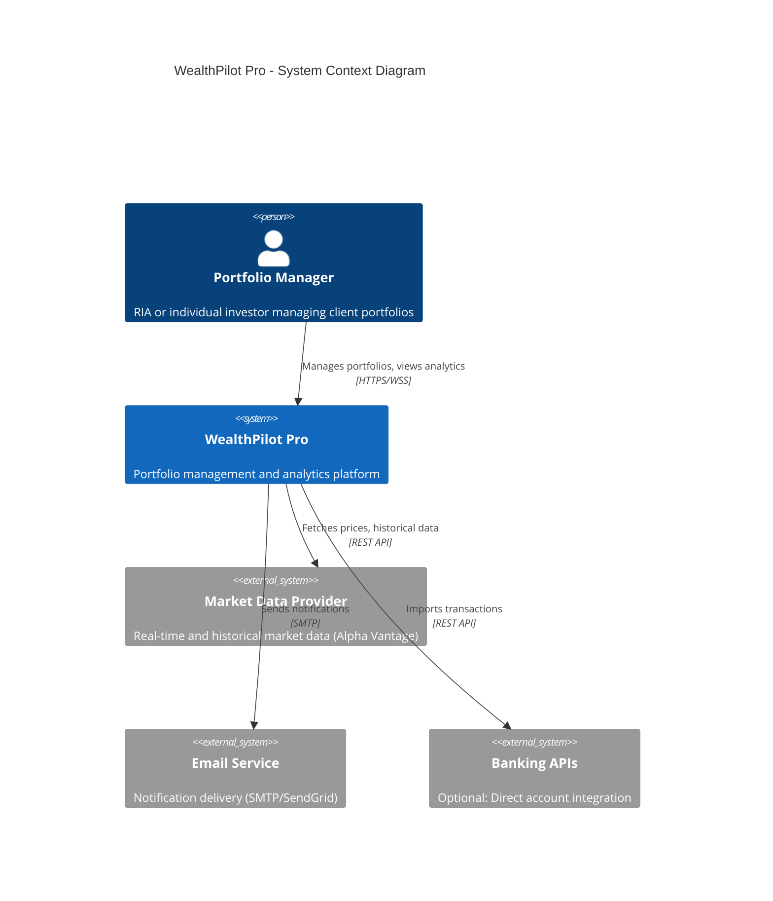
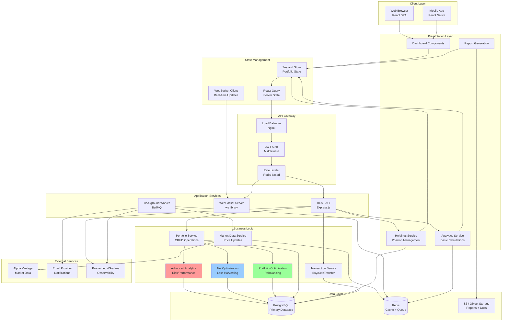
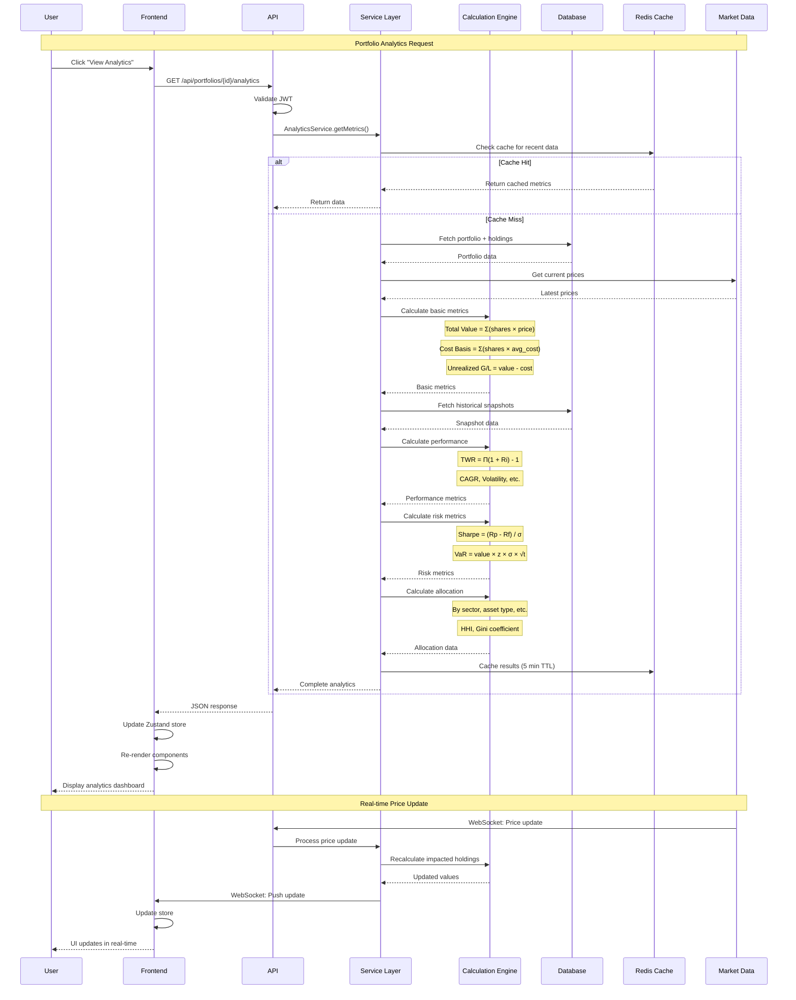
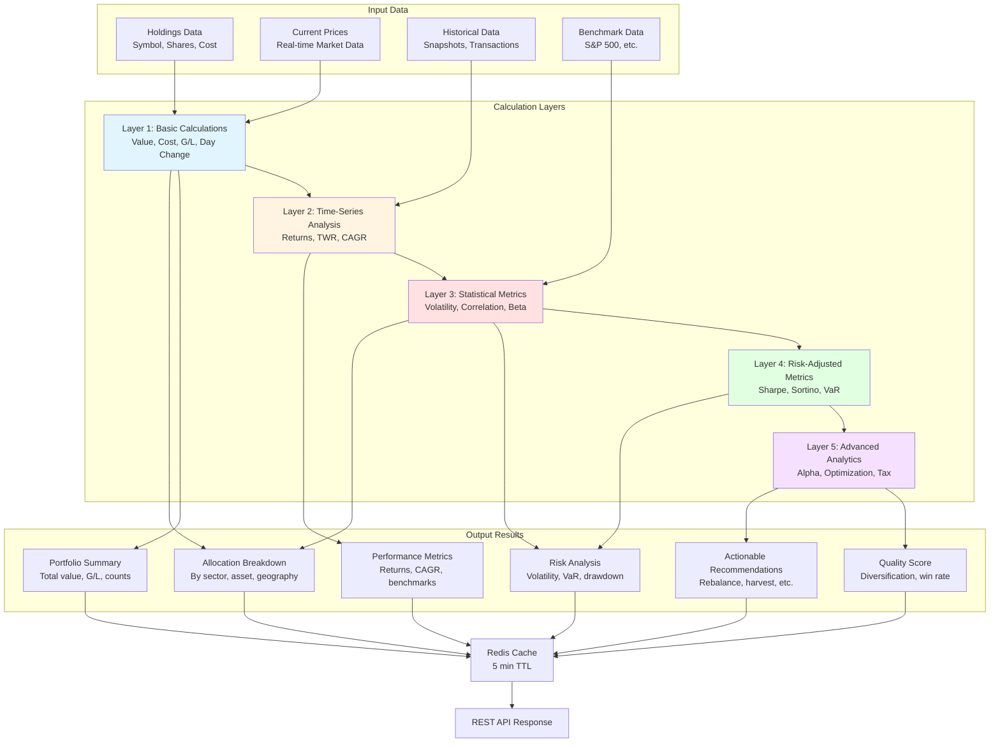
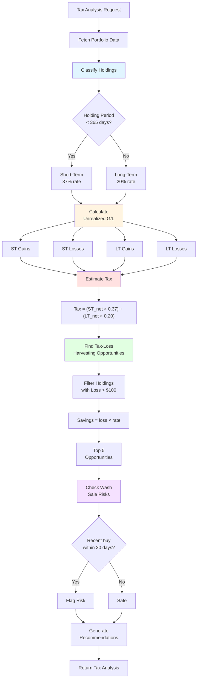
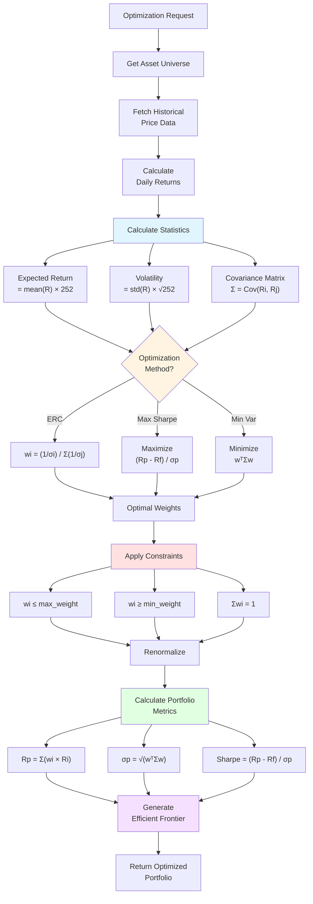

# WealthPilot Pro - System Architecture Overview

## Complete System Architecture



## Component Architecture



## Data Flow Architecture



## Calculation Engine Architecture



## Calculation Dependency Graph

```mermaid
graph LR
    subgraph "Raw Data"
        A[Holdings:<br/>shares, cost_basis]
        B[Prices:<br/>current_price]
        C[History:<br/>snapshots]
    end
    
    subgraph "Level 1: Direct Calculations"
        D[Market Value<br/>= shares × price]
        E[Unrealized G/L<br/>= value - cost]
        F[Day Change<br/>= shares × Δprice]
    end
    
    subgraph "Level 2: Aggregations"
        G[Total Value<br/>= Σ(market_values)]
        H[Total G/L<br/>= Σ(unrealized_gl)]
        I[Portfolio Weight<br/>= value / total × 100]
    end
    
    subgraph "Level 3: Time Series"
        J[Daily Returns<br/>= Δvalue / value]
        K[Cumulative Return<br/>= Π(1 + Ri) - 1]
        L[Period Returns<br/>1M, 3M, YTD, etc.]
    end
    
    subgraph "Level 4: Statistical"
        M[Mean Return<br/>= Σ(Ri) / n]
        N[Volatility<br/>= StdDev × √252]
        O[Correlation<br/>with Benchmark]
    end
    
    subgraph "Level 5: Risk-Adjusted"
        P[Sharpe Ratio<br/>= excess / vol]
        Q[Sortino Ratio<br/>= excess / downside]
        R[Beta<br/>= Cov / Var]
    end
    
    subgraph "Level 6: Advanced"
        S[Alpha<br/>= Rp - CAPM]
        T[VaR<br/>= value × z × σ]
        U[HHI<br/>= Σ(wi²)]
    end
    
    A --> D
    B --> D
    D --> E
    A --> E
    D --> F
    B --> F
    
    D --> G
    E --> H
    G --> I
    D --> I
    
    G --> J
    C --> J
    J --> K
    J --> L
    
    J --> M
    J --> N
    J --> O
    
    M --> P
    N --> P
    M --> Q
    N --> Q
    O --> R
    
    P --> S
    R --> S
    N --> T
    G --> T
    I --> U
    
    style D fill:#e1f5ff
    style G fill:#fff4e1
    style J fill:#ffe1e1
    style M fill:#e1ffe1
    style P fill:#f5e1ff
    style S fill:#ffe1f5
```

## Tax Calculation Pipeline



## Optimization Calculation Flow



---

## Key Calculation Formulas Reference

### Basic Metrics
| Metric | Formula | Purpose |
|--------|---------|---------|
| Market Value | `shares × current_price` | Current position value |
| Cost Basis | `shares × average_cost` | Total amount invested |
| Unrealized G/L | `market_value - cost_basis` | Paper profit/loss |
| Day Change | `shares × (price_today - price_yesterday)` | Daily P&L |

### Performance Metrics
| Metric | Formula | Purpose |
|--------|---------|---------|
| Simple Return | `(end_value - start_value) / start_value` | Total return % |
| TWR | `Π(1 + Ri) - 1` | Time-weighted return |
| CAGR | `(end/start)^(1/years) - 1` | Annualized return |
| Volatility | `StdDev(returns) × √252` | Annual risk measure |

### Risk Metrics
| Metric | Formula | Purpose |
|--------|---------|---------|
| Sharpe Ratio | `(Rp - Rf) / σp` | Risk-adjusted return |
| Sortino Ratio | `(Rp - Rf) / σd` | Downside risk-adjusted |
| Beta | `Cov(Rp, Rm) / Var(Rm)` | Market sensitivity |
| Alpha | `Rp - [Rf + β(Rm - Rf)]` | Excess return |
| VaR (95%) | `value × 1.645 × σ × √days` | Maximum likely loss |

### Concentration Metrics
| Metric | Formula | Purpose |
|--------|---------|---------|
| HHI | `Σ(wi²)` | Concentration index |
| Gini Coefficient | Complex formula | Equality measure |
| Effective Holdings | `1 / HHI` | "True" diversification |

### Tax Metrics
| Metric | Formula | Purpose |
|--------|---------|---------|
| ST Tax | `gains × 0.37` | Short-term tax |
| LT Tax | `gains × 0.20` | Long-term tax |
| Tax Savings | `loss × tax_rate` | Harvesting benefit |

---

## Performance Benchmarks

### Calculation Speed
- Basic metrics: < 50ms
- Performance history: < 200ms
- Full analytics: < 500ms
- Tax analysis: < 300ms
- Optimization: < 2s

### Cache Strategy
- Price data: 1 min TTL
- Basic metrics: 5 min TTL
- Analytics: 5 min TTL
- Historical data: 1 hour TTL
- Reference data: 24 hour TTL

### Scalability
- Holdings per portfolio: Up to 1,000
- Portfolios per user: Up to 100
- Concurrent users: 1,000+
- API requests: 10,000/min
- WebSocket connections: 5,000 concurrent

