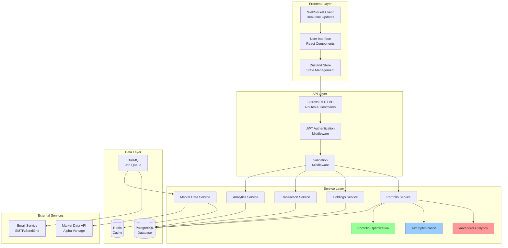
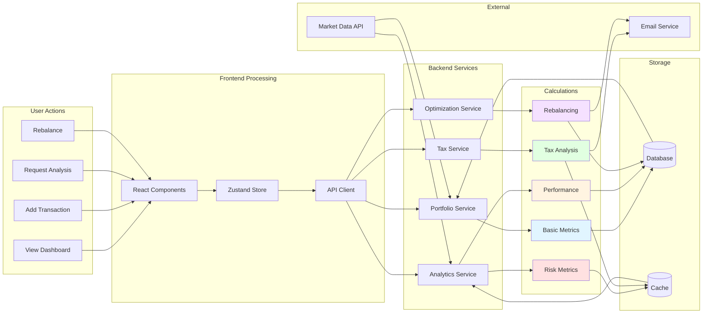

# WealthPilot Pro - Complete Calculation Flow Charts

## 1. High-Level System Architecture



## 2. Portfolio Analytics Calculation Pipeline

```mermaid
flowchart TD
    Start([User Requests<br/>Portfolio Analytics]) --> GetPortfolio[Fetch Portfolio Data<br/>from Database]
    
    GetPortfolio --> CheckCache{Data in<br/>Redis Cache?}
    CheckCache -->|Yes| ReturnCached[Return Cached Data]
    CheckCache -->|No| FetchHoldings[Fetch All Holdings<br/>+ Transactions]
    
    FetchHoldings --> GetPrices[Get Current Market Prices<br/>Alpha Vantage API]
    
    GetPrices --> CalcBasics[Calculate Basic Metrics]
    
    subgraph "Basic Calculations"
        CalcBasics --> TotalValue[Total Value<br/>= Σ(shares × price) + cash]
        TotalValue --> CostBasis[Cost Basis<br/>= Σ(shares × avg_cost)]
        CostBasis --> UnrealizedGL[Unrealized G/L<br/>= market_value - cost_basis]
        UnrealizedGL --> DayChange[Day Change<br/>= Σ(shares × price_change)]
    end
    
    DayChange --> CalcPerformance[Calculate Performance Metrics]
    
    subgraph "Performance Metrics"
        CalcPerformance --> FetchSnapshots[Get Portfolio Snapshots<br/>Historical Data]
        FetchSnapshots --> CalcReturns[Calculate Returns<br/>for each period]
        CalcReturns --> TWR[Time-Weighted Return<br/>= Π(1 + Ri) - 1]
        TWR --> CAGR[CAGR<br/>= (End/Start)^(1/years) - 1]
        CAGR --> Volatility[Volatility<br/>= StdDev(returns) × √252]
    end
    
    Volatility --> CalcRisk[Calculate Risk Metrics]
    
    subgraph "Risk Calculations"
        CalcRisk --> Sharpe[Sharpe Ratio<br/>= (Rp - Rf) / σp]
        Sharpe --> Sortino[Sortino Ratio<br/>= (Rp - Rf) / σd]
        Sortino --> MaxDD[Max Drawdown<br/>= max((peak - trough) / peak)]
        MaxDD --> VaR[Value at Risk<br/>= value × z × σ × √t]
        VaR --> Beta[Beta<br/>= Cov(Rp,Rm) / Var(Rm)]
        Beta --> Alpha[Alpha<br/>= Rp - (Rf + β(Rm - Rf))]
    end
    
    Alpha --> CalcAllocation[Calculate Allocation]
    
    subgraph "Allocation Analysis"
        CalcAllocation --> ByAsset[By Asset Type<br/>Stocks, Bonds, etc.]
        ByAsset --> BySector[By Sector<br/>Tech, Healthcare, etc.]
        BySector --> ByGeo[By Geography<br/>US, International]
        ByGeo --> HHI[HHI Index<br/>= Σ(wi²)]
        HHI --> Gini[Gini Coefficient<br/>Concentration measure]
    end
    
    Gini --> CalcQuality[Calculate Quality Score]
    
    subgraph "Quality Scoring"
        CalcQuality --> Diversification[Diversification Score<br/>= 1 - HHI]
        Diversification --> WinRate[Win Rate<br/>= profitable_holdings / total]
        WinRate --> Income[Income Score<br/>= dividend_holdings / total]
        Income --> TotalQuality[Total Quality<br/>Weighted Sum]
    end
    
    TotalQuality --> GenRec[Generate Recommendations]
    
    subgraph "Recommendations Engine"
        GenRec --> CheckConcentration{HHI > 0.25?}
        CheckConcentration -->|Yes| RecConc[Recommend: Reduce Concentration]
        CheckConcentration -->|No| CheckDiv{Holdings < 10?}
        CheckDiv -->|Yes| RecDiv[Recommend: Increase Diversification]
        CheckDiv -->|No| CheckLosses{Large losses<br/>present?}
        CheckLosses -->|Yes| RecReview[Recommend: Review Underperformers]
        CheckLosses -->|No| RecGood[Portfolio looks good]
    end
    
    RecConc --> CacheResults[Cache Results<br/>in Redis]
    RecDiv --> CacheResults
    RecReview --> CacheResults
    RecGood --> CacheResults
    
    CacheResults --> ReturnResults[Return Complete Analytics]
    ReturnCached --> ReturnResults
    
    ReturnResults --> End([Display to User])
    
    style CalcBasics fill:#e1f5ff
    style CalcPerformance fill:#fff4e1
    style CalcRisk fill:#ffe1e1
    style CalcAllocation fill:#e1ffe1
    style CalcQuality fill:#f5e1ff
    style GenRec fill:#ffe1f5
```

## 3. Tax Optimization Flow

```mermaid
flowchart TD
    Start([User Requests<br/>Tax Analysis]) --> GetData[Fetch Portfolio<br/>Holdings + Transactions]
    
    GetData --> ClassifyHoldings[Classify All Holdings]
    
    subgraph "Holding Classification"
        ClassifyHoldings --> CheckPeriod{Purchase Date<br/>< 365 days ago?}
        CheckPeriod -->|Yes| ShortTerm[Short-Term<br/>Tax Rate: 37%]
        CheckPeriod -->|No| LongTerm[Long-Term<br/>Tax Rate: 20%]
    end
    
    ShortTerm --> CalcUnrealized[Calculate Unrealized G/L]
    LongTerm --> CalcUnrealized
    
    subgraph "Unrealized G/L Calculation"
        CalcUnrealized --> STGains[Short-Term Gains<br/>= Σ(ST holdings with gain > 0)]
        CalcUnrealized --> STLosses[Short-Term Losses<br/>= Σ(ST holdings with gain < 0)]
        CalcUnrealized --> LTGains[Long-Term Gains<br/>= Σ(LT holdings with gain > 0)]
        CalcUnrealized --> LTLosses[Long-Term Losses<br/>= Σ(LT holdings with gain < 0)]
    end
    
    STGains --> CalcRealized[Calculate Realized G/L<br/>from Transactions]
    STLosses --> CalcRealized
    LTGains --> CalcRealized
    LTLosses --> CalcRealized
    
    subgraph "Realized G/L from Sells"
        CalcRealized --> FilterSells[Filter Sell Transactions<br/>for Tax Year]
        FilterSells --> ClassifySells[Classify by<br/>Holding Period]
        ClassifySells --> RealizedST[Realized ST G/L<br/>from sells < 1 year]
        ClassifySells --> RealizedLT[Realized LT G/L<br/>from sells > 1 year]
    end
    
    RealizedST --> EstimateTax[Estimate Tax Liability]
    RealizedLT --> EstimateTax
    
    subgraph "Tax Estimation"
        EstimateTax --> STTax[ST Tax<br/>= max(0, ST_net) × 0.37]
        EstimateTax --> LTTax[LT Tax<br/>= max(0, LT_net) × 0.20]
        STTax --> TotalTax[Total Tax<br/>= ST_tax + LT_tax]
        LTTax --> TotalTax
        TotalTax --> CheckLoss{Net Loss?}
        CheckLoss -->|Yes| Carryover[Calculate Carryover<br/>$3k annual limit]
        CheckLoss -->|No| PotentialTax[Calculate Potential Tax<br/>if unrealized gains sold]
    end
    
    Carryover --> FindOpportunities[Find Tax-Loss<br/>Harvesting Opportunities]
    PotentialTax --> FindOpportunities
    
    subgraph "Tax-Loss Harvesting"
        FindOpportunities --> FilterLosses[Filter Holdings<br/>with Unrealized Loss > $100]
        FilterLosses --> CalcSavings[Calculate Tax Savings<br/>= loss × tax_rate]
        CalcSavings --> SortBySavings[Sort by<br/>Tax Savings DESC]
        SortBySavings --> Top5[Select Top 5<br/>Opportunities]
    end
    
    Top5 --> CheckWashSale[Check Wash Sale Risks]
    
    subgraph "Wash Sale Detection"
        CheckWashSale --> GetRecent[Get Transactions<br/>from last 30 days]
        GetRecent --> FindSoldAtLoss[Find Sells<br/>with Losses]
        FindSoldAtLoss --> CheckRebuy{Same symbol<br/>in holdings?}
        CheckRebuy -->|Yes| WashRisk[Flag Wash Sale Risk]
        CheckRebuy -->|No| Safe[No Wash Sale Risk]
    end
    
    WashRisk --> GenTaxRec[Generate Tax<br/>Recommendations]
    Safe --> GenTaxRec
    
    subgraph "Tax Recommendations"
        GenTaxRec --> CheckHarvestValue{Total Tax Savings<br/>> $500?}
        CheckHarvestValue -->|Yes| RecHarvest[High Priority:<br/>Harvest Losses Now]
        CheckHarvestValue -->|No| CheckNearLT{Holdings near<br/>long-term?}
        CheckNearLT -->|Yes| RecHold[Medium Priority:<br/>Hold for LT Rate]
        CheckNearLT -->|No| CheckOffset{ST Gains +<br/>ST Losses?}
        CheckOffset -->|Yes| RecOffset[Medium Priority:<br/>Offset Gains]
        CheckOffset -->|No| CheckCharitable{Large LT<br/>Gains?}
        CheckCharitable -->|Yes| RecCharitable[Low Priority:<br/>Consider Donation]
        CheckCharitable -->|No| NoRec[No Specific<br/>Recommendations]
    end
    
    RecHarvest --> ReturnAnalysis[Return Complete<br/>Tax Analysis]
    RecHold --> ReturnAnalysis
    RecOffset --> ReturnAnalysis
    RecCharitable --> ReturnAnalysis
    NoRec --> ReturnAnalysis
    
    ReturnAnalysis --> End([Display to User])
    
    style ClassifyHoldings fill:#fff4e1
    style CalcUnrealized fill:#e1f5ff
    style CalcRealized fill:#ffe1e1
    style EstimateTax fill:#e1ffe1
    style FindOpportunities fill:#f5e1ff
    style CheckWashSale fill:#ffe1f5
    style GenTaxRec fill:#e1ffff
```

## 4. Lot Selection Strategy Flow

```mermaid
flowchart TD
    Start([User Wants to<br/>Sell Shares]) --> GetLots[Fetch All Tax Lots<br/>for Symbol]
    
    GetLots --> CheckStrategy{Lot Selection<br/>Strategy?}
    
    CheckStrategy -->|FIFO| SortFIFO[Sort by Purchase Date<br/>Oldest First]
    CheckStrategy -->|LIFO| SortLIFO[Sort by Purchase Date<br/>Newest First]
    CheckStrategy -->|HIFO| SortHIFO[Sort by Cost Basis<br/>Highest First]
    CheckStrategy -->|Tax-Efficient| SortOptimal[Custom Tax-Optimal Sort]
    
    subgraph "Tax-Efficient Sorting Logic"
        SortOptimal --> CalcGainLoss[Calculate G/L<br/>for Each Lot]
        CalcGainLoss --> IsLoss{Loss or Gain?}
        IsLoss -->|Loss| CheckLTLoss{Long-Term<br/>Loss?}
        IsLoss -->|Gain| CheckLTGain{Long-Term<br/>Gain?}
        CheckLTLoss -->|Yes| Priority2[Priority: 2]
        CheckLTLoss -->|No| Priority1[Priority: 1<br/>Sell First]
        CheckLTGain -->|Yes| Priority3[Priority: 3]
        CheckLTGain -->|No| Priority4[Priority: 4<br/>Sell Last]
    end
    
    Priority1 --> SelectLots[Select Lots<br/>in Priority Order]
    Priority2 --> SelectLots
    Priority3 --> SelectLots
    Priority4 --> SelectLots
    SortFIFO --> SelectLots
    SortLIFO --> SelectLots
    SortHIFO --> SelectLots
    
    subgraph "Lot Selection Process"
        SelectLots --> Initialize[Initialize:<br/>remaining_shares = shares_to_sell]
        Initialize --> NextLot{More lots<br/>available?}
        NextLot -->|No| InsufficientShares[Error: Insufficient Shares]
        NextLot -->|Yes| CheckRemaining{remaining_shares<br/>> 0?}
        CheckRemaining -->|No| Complete[Selection Complete]
        CheckRemaining -->|Yes| CalcTakeShares[shares_to_take<br/>= min(lot.shares, remaining)]
        CalcTakeShares --> CalcImpact[Calculate Tax Impact<br/>for this lot]
    end
    
    subgraph "Tax Impact Calculation"
        CalcImpact --> GetPrice[Get Current Price]
        GetPrice --> CalcProceeds[Proceeds<br/>= shares × price]
        CalcProceeds --> CalcCost[Cost Basis<br/>= shares × lot.cost_per_share]
        CalcCost --> CalcGL[Gain/Loss<br/>= proceeds - cost_basis]
        CalcGL --> IsLT{Holding Period<br/>> 365 days?}
        IsLT -->|Yes| TaxLT[Tax Impact<br/>= G/L × 0.20]
        IsLT -->|No| TaxST[Tax Impact<br/>= G/L × 0.37]
    end
    
    TaxLT --> AddToSelected[Add Lot to<br/>Selected List]
    TaxST --> AddToSelected
    AddToSelected --> UpdateRemaining[remaining_shares<br/>-= shares_to_take]
    UpdateRemaining --> NextLot
    
    Complete --> CompareStrategies[Compare All Strategies]
    
    subgraph "Strategy Comparison"
        CompareStrategies --> RunFIFO[Simulate FIFO<br/>Total Tax: $X]
        CompareStrategies --> RunLIFO[Simulate LIFO<br/>Total Tax: $Y]
        CompareStrategies --> RunHIFO[Simulate HIFO<br/>Total Tax: $Z]
        CompareStrategies --> RunOptimal[Simulate Tax-Efficient<br/>Total Tax: $W]
    end
    
    RunFIFO --> CreateSummary[Create Summary<br/>+ Comparison]
    RunLIFO --> CreateSummary
    RunHIFO --> CreateSummary
    RunOptimal --> CreateSummary
    
    CreateSummary --> ReturnResults[Return Selected Lots<br/>+ Tax Impact<br/>+ Comparison]
    
    InsufficientShares --> Error([Error Message])
    ReturnResults --> End([User Reviews<br/>& Confirms])
    
    style SortOptimal fill:#ffe1e1
    style SelectLots fill:#e1f5ff
    style CalcImpact fill:#fff4e1
    style CompareStrategies fill:#e1ffe1
```

## 5. Portfolio Rebalancing Flow

```mermaid
flowchart TD
    Start([User Requests<br/>Rebalancing]) --> InputTarget[Input Target Allocation<br/>or Select Model Portfolio]
    
    InputTarget --> SelectModel{Use Model<br/>Portfolio?}
    SelectModel -->|Yes| LoadModel[Load Model Allocation<br/>Conservative/Moderate/Aggressive]
    SelectModel -->|No| UseCustom[Use Custom<br/>Target Allocation]
    
    LoadModel --> GetCurrent[Fetch Current Portfolio<br/>Holdings + Cash]
    UseCustom --> GetCurrent
    
    GetCurrent --> CalcCurrentAlloc[Calculate Current Allocation]
    
    subgraph "Current Allocation Calculation"
        CalcCurrentAlloc --> TotalVal[Total Value<br/>= Σ(holdings) + cash]
        TotalVal --> CalcWeights[Current Weights<br/>= holding_value / total_value × 100]
        CalcWeights --> CashWeight[Cash Weight<br/>= cash / total_value × 100]
    end
    
    CashWeight --> CalcDrift[Calculate Drift<br/>for Each Position]
    
    subgraph "Drift Analysis"
        CalcDrift --> ForEachPosition[For Each Target Position]
        ForEachPosition --> GetTarget[Get Target Weight]
        GetTarget --> GetActual[Get Actual Weight]
        GetActual --> ComputeDrift[Drift<br/>= |target - actual|]
        ComputeDrift --> DriftPercent[Drift %<br/>= drift / total_value × 100]
    end
    
    DriftPercent --> CheckThreshold{Drift ><br/>Threshold?}
    
    CheckThreshold -->|No| NoDrift[Position is<br/>On Target]
    CheckThreshold -->|Yes| CheckMinTrade{|Trade Amount|<br/>> $100?}
    CheckMinTrade -->|No| TooSmall[Trade Too Small<br/>Skip]
    CheckMinTrade -->|Yes| CalcTrade[Calculate Trade Details]
    
    subgraph "Trade Calculation"
        CalcTrade --> TargetValue[Target Value<br/>= total_value × target_weight]
        TargetValue --> CurrentValue[Current Value<br/>= shares × price]
        CurrentValue --> TradeAmount[Trade Amount<br/>= target - current]
        TradeAmount --> CheckDirection{Trade Amount<br/>Positive?}
        CheckDirection -->|Yes| ActionBuy[Action: BUY]
        CheckDirection -->|No| ActionSell[Action: SELL]
        ActionBuy --> GetPrice[Get Current Price]
        ActionSell --> GetPrice
        GetPrice --> CalcShares[Shares<br/>= |amount| / price]
    end
    
    CalcShares --> AddTrade[Add to Trade List]
    NoDrift --> NextPosition{More<br/>Positions?}
    TooSmall --> NextPosition
    AddTrade --> NextPosition
    NextPosition -->|Yes| ForEachPosition
    NextPosition -->|No| CheckUnwanted[Check for Unwanted Positions]
    
    subgraph "Unwanted Positions"
        CheckUnwanted --> FindExtra[Find Holdings Not<br/>in Target Allocation]
        FindExtra --> ExtraExists{Unwanted<br/>Holdings?}
        ExtraExists -->|Yes| AddSellAll[Add SELL ALL<br/>to Trade List]
        ExtraExists -->|No| NoExtra[No Unwanted Holdings]
    end
    
    AddSellAll --> SortTrades[Sort Trades:<br/>Sells First, Then Buys]
    NoExtra --> SortTrades
    
    SortTrades --> CalcCashFlow[Calculate Net Cash Flow]
    
    subgraph "Cash Flow Analysis"
        CalcCashFlow --> SumSells[Total Sell Proceeds<br/>= Σ(sell amounts)]
        CalcCashFlow --> SumBuys[Total Buy Cost<br/>= Σ(buy amounts)]
        SumSells --> NetCash[Net Cash<br/>= sells - buys]
        SumBuys --> NetCash
        NetCash --> FinalCash[Final Cash<br/>= current_cash + net_cash]
    end
    
    FinalCash --> CheckFeasible{Final Cash<br/>>= 0?}
    CheckFeasible -->|No| InsufficientCash[Error: Insufficient Cash<br/>Adjust Trades]
    CheckFeasible -->|Yes| SimulateAfter[Simulate Post-Rebalance<br/>Allocation]
    
    subgraph "Post-Rebalance Simulation"
        SimulateAfter --> ApplyTrades[Apply All Trades<br/>to Holdings]
        ApplyTrades --> RecalcWeights[Recalculate<br/>New Weights]
        RecalcWeights --> VerifyTarget{Weights match<br/>target?}
        VerifyTarget -->|No| AdjustTrades[Adjust Trade Amounts]
        VerifyTarget -->|Yes| ValidationPass[Validation Passed]
    end
    
    AdjustTrades --> SimulateAfter
    ValidationPass --> CreateSummary[Create Rebalancing Summary]
    
    subgraph "Summary Creation"
        CreateSummary --> TradeCount[Total Trades: N]
        CreateSummary --> BuyTotal[Total to Buy: $X]
        CreateSummary --> SellTotal[Total to Sell: $Y]
        CreateSummary --> EstCost[Estimated Cost: $0<br/>commission-free]
        CreateSummary --> BeforeAfter[Before/After<br/>Allocation Comparison]
    end
    
    BeforeAfter --> ReturnPlan[Return Rebalancing Plan]
    InsufficientCash --> Error([Error Message])
    
    ReturnPlan --> UserReview[User Reviews Plan]
    UserReview --> Approve{Approve<br/>Trades?}
    Approve -->|No| Cancel([Cancelled])
    Approve -->|Yes| ExecuteTrades[Execute All Trades<br/>via API]
    
    ExecuteTrades --> UpdateDB[Update Database<br/>Holdings + Transactions]
    UpdateDB --> SendNotif[Send Email Notification<br/>Rebalancing Complete]
    SendNotif --> End([Rebalancing Complete])
    
    style CalcCurrentAlloc fill:#e1f5ff
    style CalcDrift fill:#fff4e1
    style CalcTrade fill:#ffe1e1
    style CheckUnwanted fill:#f5e1ff
    style CalcCashFlow fill:#e1ffe1
    style SimulateAfter fill:#ffe1f5
    style CreateSummary fill:#e1ffff
```

## 6. Portfolio Optimization (Mean-Variance) Flow

```mermaid
flowchart TD
    Start([User Requests<br/>Portfolio Optimization]) --> InputSymbols[Input Asset Universe<br/>List of Symbols]
    
    InputSymbols --> InputConstraints[Input Constraints]
    
    subgraph "Constraint Inputs"
        InputConstraints --> MaxWeight[Max Weight per Asset<br/>Default: 30%]
        InputConstraints --> MinWeight[Min Weight per Asset<br/>Default: 2%]
        InputConstraints --> TargetReturn[Target Return<br/>Optional]
        InputConstraints --> MaxVol[Max Volatility<br/>Optional]
        InputConstraints --> RiskFree[Risk-Free Rate<br/>Default: 5%]
    end
    
    MaxWeight --> FetchData[Fetch Historical Data<br/>for All Assets]
    MinWeight --> FetchData
    TargetReturn --> FetchData
    MaxVol --> FetchData
    RiskFree --> FetchData
    
    subgraph "Data Collection"
        FetchData --> GetPrices[Get Daily Prices<br/>Last 3 Years]
        GetPrices --> CalcReturns[Calculate Daily Returns<br/>Ri = (Pi - Pi-1) / Pi-1]
        CalcReturns --> CalcExpReturn[Expected Return<br/>= Average(returns) × 252]
        CalcExpReturn --> CalcVolatility[Volatility<br/>= StdDev(returns) × √252]
        CalcVolatility --> CalcCov[Covariance Matrix<br/>Σ = Cov(Ri, Rj)]
    end
    
    CalcCov --> ChooseMethod{Optimization<br/>Method?}
    
    ChooseMethod -->|Equal Risk| EqualRisk[Equal Risk Contribution]
    ChooseMethod -->|Max Sharpe| MaxSharpe[Maximum Sharpe Ratio]
    ChooseMethod -->|Min Variance| MinVar[Minimum Variance]
    ChooseMethod -->|Target Return| TargetRet[Target Return Optimization]
    
    subgraph "Equal Risk Contribution"
        EqualRisk --> InverseVol[Calculate Inverse Volatility<br/>1/σi for each asset]
        InverseVol --> SumInverseVol[Sum All Inverse Vols<br/>Σ(1/σi)]
        SumInverseVol --> ERCWeights[Weights<br/>wi = (1/σi) / Σ(1/σj)]
        ERCWeights --> NormalizeERC[Normalize to 100%]
    end
    
    subgraph "Maximum Sharpe Ratio"
        MaxSharpe --> SetupQP1[Setup Quadratic Program:<br/>Maximize (Rp - Rf) / σp]
        SetupQP1 --> Constraints1[Subject to:<br/>Σwi = 1, 0 ≤ wi ≤ max_weight]
        Constraints1 --> SolveQP1[Solve Optimization<br/>Tangency Portfolio]
        SolveQP1 --> SharpeWeights[Optimal Weights<br/>for Max Sharpe]
    end
    
    subgraph "Minimum Variance"
        MinVar --> SetupQP2[Setup Quadratic Program:<br/>Minimize wᵀΣw]
        SetupQP2 --> Constraints2[Subject to:<br/>Σwi = 1, 0 ≤ wi ≤ max_weight]
        Constraints2 --> SolveQP2[Solve Optimization<br/>Minimum Risk]
        SolveQP2 --> MinVarWeights[Optimal Weights<br/>for Min Variance]
    end
    
    subgraph "Target Return"
        TargetRet --> SetupQP3[Setup Quadratic Program:<br/>Minimize wᵀΣw]
        SetupQP3 --> Constraints3[Subject to:<br/>Σwi = 1, Rp = target]
        Constraints3 --> SolveQP3[Solve Optimization<br/>Efficient Portfolio]
        SolveQP3 --> TargetWeights[Optimal Weights<br/>for Target Return]
    end
    
    NormalizeERC --> ApplyConstraints[Apply Min/Max Constraints]
    SharpeWeights --> ApplyConstraints
    MinVarWeights --> ApplyConstraints
    TargetWeights --> ApplyConstraints
    
    ApplyConstraints --> AdjustWeights[Adjust Weights<br/>to Meet Constraints]
    AdjustWeights --> RenormalizeWeights[Renormalize to 100%]
    
    RenormalizeWeights --> CalcPortMetrics[Calculate Portfolio Metrics]
    
    subgraph "Portfolio Metrics Calculation"
        CalcPortMetrics --> PortReturn[Portfolio Return<br/>Rp = Σ(wi × Ri)]
        CalcPortMetrics --> PortVol[Portfolio Volatility<br/>σp = √(wᵀΣw)]
        PortReturn --> PortSharpe[Portfolio Sharpe<br/>= (Rp - Rf) / σp]
        PortVol --> PortSharpe
        PortSharpe --> DivRatio[Diversification Ratio<br/>= Σ(wi×σi) / σp]
    end
    
    DivRatio --> CreateEfficientFrontier[Create Efficient Frontier<br/>Sample 50 Points]
    
    subgraph "Efficient Frontier"
        CreateEfficientFrontier --> MinReturnPoint[Point 1:<br/>Min Variance Portfolio]
        CreateEfficientFrontier --> MaxReturnPoint[Point 50:<br/>Max Return Portfolio]
        CreateEfficientFrontier --> IntermediatePoints[Points 2-49:<br/>Intermediate Returns]
        MinReturnPoint --> PlotFrontier[Plot Return vs Risk]
        MaxReturnPoint --> PlotFrontier
        IntermediatePoints --> PlotFrontier
        PlotFrontier --> MarkTangency[Mark Tangency Portfolio<br/>Max Sharpe Point]
    end
    
    MarkTangency --> CompareModels[Compare with Model Portfolios]
    
    subgraph "Model Comparison"
        CompareModels --> Conservative[Conservative:<br/>Sharpe = X, Vol = Y%]
        CompareModels --> Moderate[Moderate:<br/>Sharpe = X, Vol = Y%]
        CompareModels --> Aggressive[Aggressive:<br/>Sharpe = X, Vol = Y%]
    end
    
    Conservative --> CreateReport[Create Optimization Report]
    Moderate --> CreateReport
    Aggressive --> CreateReport
    
    CreateReport --> ReturnResults[Return Optimized Weights<br/>+ Metrics + Frontier]
    
    ReturnResults --> UserDecision{Select<br/>Portfolio?}
    UserDecision -->|Yes| ApplyToPortfolio[Generate Rebalancing Trades<br/>to Match Optimal Weights]
    UserDecision -->|No| SaveForLater[Save Optimization<br/>for Later Review]
    
    ApplyToPortfolio --> End1([Execute Rebalancing])
    SaveForLater --> End2([Analysis Saved])
    
    style FetchData fill:#e1f5ff
    style EqualRisk fill:#fff4e1
    style MaxSharpe fill:#ffe1e1
    style MinVar fill:#e1ffe1
    style TargetRet fill:#f5e1ff
    style CalcPortMetrics fill:#ffe1f5
    style CreateEfficientFrontier fill:#e1ffff
```

## 7. Real-Time Market Data Update Flow

```mermaid
flowchart TD
    Start([Market Opens<br/>9:30 AM ET]) --> WSConnect[Establish WebSocket<br/>Connection]
    
    WSConnect --> Authenticate[Authenticate User<br/>JWT Token]
    Authenticate --> GetPortfolios[Fetch User's Portfolios<br/>from Database]
    GetPortfolios --> ExtractSymbols[Extract All Unique<br/>Symbols from Holdings]
    
    ExtractSymbols --> Subscribe[Subscribe to Price Updates<br/>via WebSocket]
    
    subgraph "WebSocket Subscription"
        Subscribe --> SendSubscribe[Send: Subscribe Message<br/>{type: 'subscribe', symbols: [...]}]
        SendSubscribe --> ServerAck[Server Acknowledges<br/>Subscription]
        ServerAck --> StartStream[Begin Real-Time<br/>Price Stream]
    end
    
    StartStream --> WaitUpdate[Wait for Price Update]
    
    WaitUpdate --> ReceiveUpdate[Receive Update<br/>{symbol, price, change}]
    
    subgraph "Price Update Processing"
        ReceiveUpdate --> ParseData[Parse Update Data]
        ParseData --> ValidateData{Data Valid?}
        ValidateData -->|No| LogError[Log Error]
        ValidateData -->|Yes| CheckSymbol{Symbol in<br/>User Portfolio?}
        CheckSymbol -->|No| Ignore[Ignore Update]
        CheckSymbol -->|Yes| UpdateCache[Update Redis Cache<br/>symbol:price]
    end
    
    UpdateCache --> FindHoldings[Find All Holdings<br/>with This Symbol]
    
    FindHoldings --> UpdateHolding[For Each Holding]
    
    subgraph "Holding Update Calculation"
        UpdateHolding --> OldPrice[Get Old Price]
        OldPrice --> NewPrice[Set New Price]
        NewPrice --> CalcNewValue[Market Value<br/>= shares × new_price]
        CalcNewValue --> CalcDayChange[Day Change<br/>= shares × price_change]
        CalcDayChange --> CalcUnrealizedGL[Unrealized G/L<br/>= market_value - cost_basis]
        CalcUnrealizedGL --> UpdateStoreHolding[Update Zustand Store<br/>holding.price, .marketValue, etc.]
    end
    
    UpdateStoreHolding --> CheckAlerts[Check Price Alerts<br/>for This Symbol]
    
    subgraph "Alert Checking"
        CheckAlerts --> GetAlerts[Get User's Active Alerts<br/>for Symbol]
        GetAlerts --> ForEachAlert[For Each Alert]
        ForEachAlert --> CheckCondition{Alert Condition<br/>Met?}
        CheckCondition -->|Above| CheckAbove{price ><br/>threshold?}
        CheckCondition -->|Below| CheckBelow{price <<br/>threshold?}
        CheckCondition -->|Change %| CheckChange{|change| ><br/>threshold%?}
        CheckAbove -->|Yes| TriggerAlert[Trigger Alert]
        CheckBelow -->|Yes| TriggerAlert
        CheckChange -->|Yes| TriggerAlert
        CheckAbove -->|No| NoTrigger[No Alert]
        CheckBelow -->|No| NoTrigger
        CheckChange -->|No| NoTrigger
    end
    
    TriggerAlert --> SendNotification[Send Notification]
    
    subgraph "Notification Dispatch"
        SendNotification --> WebSocketPush[Push to User<br/>via WebSocket]
        SendNotification --> EmailQueue[Queue Email<br/>BullMQ]
        SendNotification --> UpdateAlertStatus[Update Alert Status<br/>last_triggered]
    end
    
    WebSocketPush --> UIUpdate[Frontend Receives Update]
    
    subgraph "Frontend UI Update"
        UIUpdate --> UpdateComponents[Update React Components]
        UpdateComponents --> HoldingsTable[Holdings Table<br/>Shows New Price]
        UpdateComponents --> DashboardCards[Dashboard Cards<br/>Updated Totals]
        UpdateComponents --> Charts[Charts Re-render<br/>with New Data]
        UpdateComponents --> Notifications[Show Alert Toast<br/>if Triggered]
    end
    
    Notifications --> RecalcMetrics{Time to Recalc<br/>Metrics?}
    RecalcMetrics -->|Every 5 min| RecalcPortfolio[Recalculate Portfolio<br/>Total Value, Day Change]
    RecalcMetrics -->|No| WaitUpdate
    
    RecalcPortfolio --> BroadcastUpdate[Broadcast Portfolio Update<br/>to Frontend]
    BroadcastUpdate --> WaitUpdate
    
    NoTrigger --> WaitUpdate
    Ignore --> WaitUpdate
    LogError --> WaitUpdate
    
    subgraph "Market Close Handling"
        WaitUpdate --> CheckTime{Time?}
        CheckTime -->|4:00 PM ET| MarketClose[Market Closes]
        CheckTime -->|6:00 PM ET| AfterHoursClose[After Hours Close]
        MarketClose --> CreateSnapshot[Create Daily Snapshot<br/>Save to DB]
        CreateSnapshot --> UnsubscribeSymbols[Unsubscribe from Symbols]
        AfterHoursClose --> UnsubscribeSymbols
        UnsubscribeSymbols --> CloseWS[Close WebSocket]
    end
    
    CloseWS --> End([Wait for Next<br/>Market Open])
    
    style WSConnect fill:#e1f5ff
    style UpdateCache fill:#fff4e1
    style UpdateHolding fill:#ffe1e1
    style CheckAlerts fill:#e1ffe1
    style SendNotification fill:#f5e1ff
    style UIUpdate fill:#ffe1f5
```

## 8. Complete Data Flow Summary



---

## Key Decision Points

### 1. When to Recalculate?
- **Real-time**: Price updates, portfolio value
- **On-demand**: Analytics, optimization
- **Scheduled**: Daily snapshots, weekly reports
- **Cached**: Recent calculations (5 min TTL)

### 2. Performance Optimization
- Cache frequently accessed data (Redis)
- Batch market data requests
- Lazy load analytics (only when requested)
- Pre-calculate common metrics

### 3. Error Handling
- Validation at API layer
- Fallback to cached data on API failure
- Graceful degradation (show stale data)
- User-friendly error messages

### 4. Calculation Priority
1. **Critical**: Portfolio value, day change
2. **High**: Risk metrics, allocation
3. **Medium**: Performance history, benchmarks
4. **Low**: Recommendations, optimization

---

This comprehensive flowchart documentation shows how every calculation flows through the system, from user input to final output!
